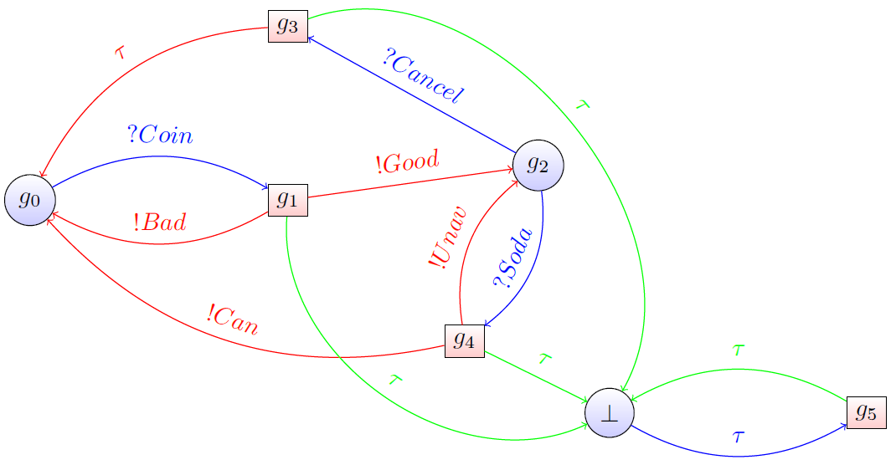

# SUT_trickle

The main script is `tester_SUT_iteraction.py`.
The goal was to test a system relying on the tickle algorithm to propagate an update for captors while minimizing the electric energy required for these captors. As we had to implent it at the same time, we could not apply our code to their system but to a vending machine.

All the details of our method is in 'rapport_EI.py'. To put it in a nutshell, an instance of IATesteur has to navigate in this graph in order to get a specific sequence of inputs and outputs in the system under test (SUT) called *test purpose*. Once it succeeds, the instance has to come back to the initial state. Whenever the output of the SUT goes out of the test purpose while the instance and the SUT were in it, the instance has to make the system go back to the initial state. 
When the SUT gives a wrong output or the interaction has been arbitrarily too long, the test is a failure.

The text boisson_record* records the interactions the instance and the SUT had during the test and its conclusion.
